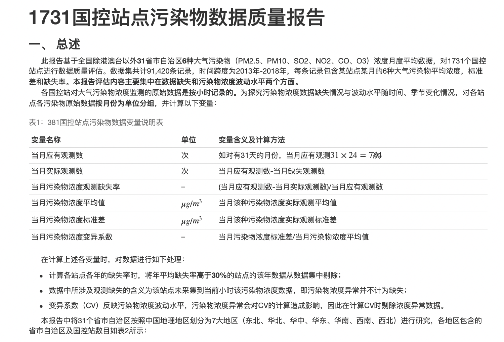
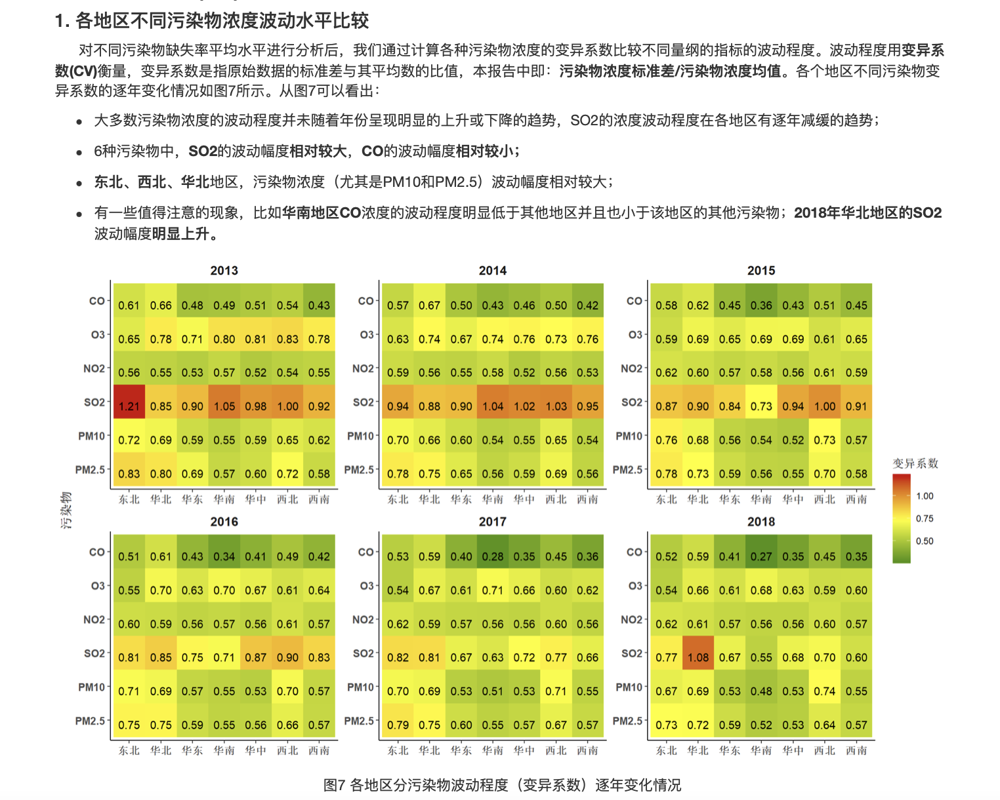
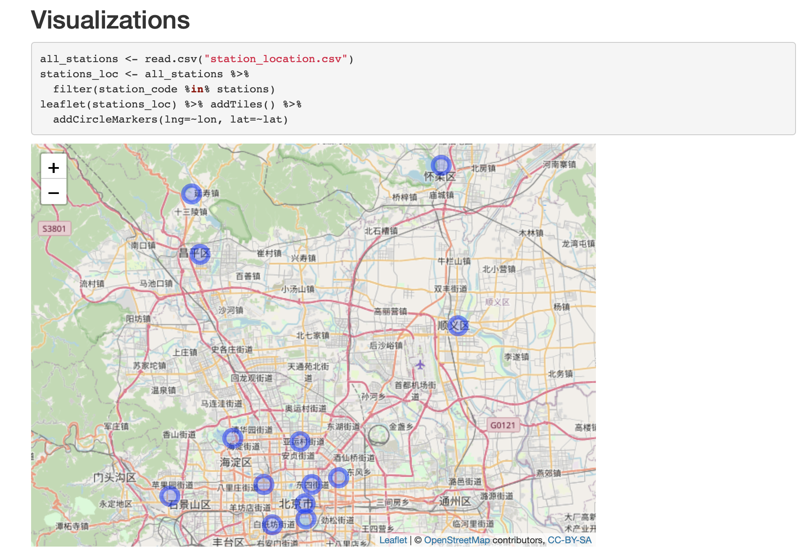
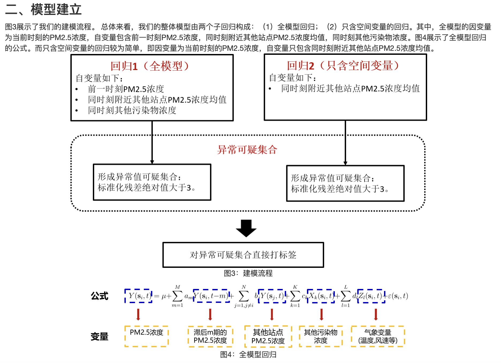
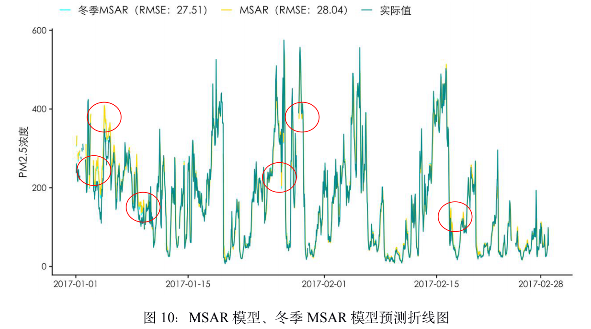

# Spatial-Temporal-Modeling-with-PM2.5-Data
 
A project about Spatial-Temporal modeling with PM2.5 data.

Including:

- Data Analysis
- Visualization
- Spatial-Temporal Model Coding
- Onging Paper
- Dissertation
- Report HTMLs
- ......

## Some Figures:

